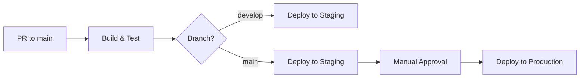

# GitHub Environments Configuration

This document explains how to set up GitHub Environments for the Barberly project to enable protected deployments and manual approvals.

## Required Environments

### 1. Staging Environment
- **Name**: `staging`
- **URL**: `https://staging.barberly.app`
- **Protection Rules**: None (automatic deployment)
- **Secrets**: 
  - `STAGING_DEPLOY_KEY`
  - `STAGING_API_URL`

### 2. Production Environment
- **Name**: `production`
- **URL**: `https://barberly.app`
- **Protection Rules**:
  - Required reviewers: 2 team members
  - Wait timer: 0 minutes
  - Allowed branches: `main` only
- **Secrets**:
  - `PRODUCTION_DEPLOY_KEY`
  - `PRODUCTION_API_URL`
  - `PRODUCTION_DATABASE_URL`

## Setup Instructions

1. Go to repository Settings → Environments
2. Click "New environment"
3. Create environments with the names above
4. Configure protection rules as specified
5. Add required secrets to each environment

## Deployment Flow

## Emergency Deployment

For urgent hotfixes, use the workflow_dispatch trigger with:
- `environment: production`
- `skip_tests: true` (only for critical security fixes)

This will bypass normal approval processes but still require manual trigger.
